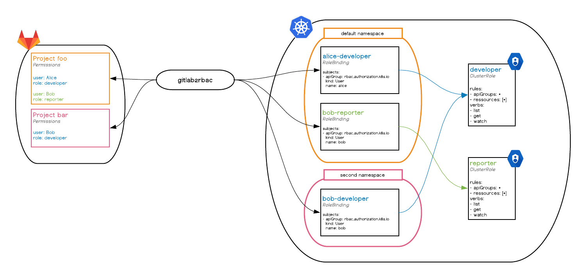

# gitlab2rbac
**This is a beta version. `gitlab2rbac` is still undergoing final testing before its official release.**

`gitlab2rbac` ensures that your Kubernetes cluster users have the same permissions than on GitLab.

It takes [GitLab Permissions](https://docs.gitlab.com/ee/user/permissions.html) by project as input and generates [RBAC](https://kubernetes.io/docs/admin/authorization/rbac/) objects inside Kubernetes.



## Installation
### Requirements
Before everything, `gitlab2rbac` requires:

* [RBAC enabled on your Kubernetes cluster](https://kubernetes.io/docs/reference/access-authn-authz/rbac/)
* [GitLab API with v4 support](https://docs.gitlab.com/ee/api/v3_to_v4.html)

### Configuration
`gitlab2rbac` needs a namespace, cluster roles and cluster role bindings. Create them with:

```sh
$ kubectl apply -f https://raw.githubusercontent.com/numberly/gitlab2rbac/master/deploy/configuration.yaml
```

You will then need to create a [ConfigMap](https://kubernetes.io/docs/tasks/configure-pod-container/configure-pod-configmap/) that contains all the useful information for `gitlab2rbac`:

```sh
cat <<EOF | kubectl create -f -
apiVersion: v1
kind: ConfigMap
metadata:
  name: gitlab2rbac
  namespace: gitlab2rbac
data:
  GITLAB_URL: https://{{ your GitLab instance URL }}
  GITLAB_PRIVATE_TOKEN: {{ your GitLab private token }}
  KUBERNETES_LOAD_INCLUSTER_CONFIG: "True"
EOF
```

### Deployment
Finally, just apply the manifest:

```sh
$ kubectl apply -f https://raw.githubusercontent.com/numberly/gitlab2rbac/master/deploy/gitlab2rbac.yaml
```

This will deploy `gitlab2rbac` to your cluster, under the `gitlab2rbac` namespace. The components in the manifest are:

* the deployment, which is the cluster-wide controller that handles RBAC policies
* the service account and the RBAC permissions that the controller need to function

## Running locally
### Requirements
* Python 3 (should also work with Python 2 but it's not supported)
* Virtualenv (recommended)

### Setup
Even if `gitlab2rbac` doesn't run inside Kubernetes, it needs a cluster with existing cluster roles. Create them with:

```sh
$ kubectl apply -f https://raw.githubusercontent.com/numberly/gitlab2rbac/master/deploy/configuration.yaml
```

Then you can clone the repository, install the dependencies and run `gitlab2rbac`:

```sh
$ git clone https://github.com/numberly/gitlab2rbac.git
$ cd gitlab2rbac
$ virtualenv .venv && source .venv/bin/activate
(.venv) $ pip install -r requirements.txt
(.venv) $ GITLAB_URL={{ your GitLab instance URL }} GITLAB_PRIVATE_TOKEN={{ your GitLab private token }} python gitlab2rbac.py
```

## Default configuration
### Roles description
| Role       | Use cases                | Typical examples                    |
|:----------:|:------------------------:|-------------------------------------|
| Guest      | Inspiration              | Someone from another team           |
| Reporter   | Complete overview, tests | Project manager, marketing          |
| Developer  | Deployment, debug        | Engineer, technical project manager |
| Maintainer | Sensitive configurations | Lead/senior engineer                |

### RBAC grid
What we mean by `R` and `W` is defined by Kubernetes API verbs:
* Read (`R`): `get`, `list`, `watch`
* Write (`W`): `create`, `update`, `patch`, `delete`, `deletecollection`

#### Cluster-wide
Any authenticated user has access to those cluster-wide resources:
* apiservices
* componentstatuses
* namespaces
* nodes

Any admin on GitLab is an admin of the Kubernetes cluster.

#### Workload
| Resource                 | Guest | Reporter | Developer | Maintainer |
|:------------------------:|:-----:|:--------:|:---------:|:----------:|
| cronjobs                 | R     | R        | R+W       | R+W        |
| daemonsets               | R     | R        | R+W       | R+W        |
| deployments              | R     | R        | R+W       | R+W        |
| horizontalpodautoscalers | R     | R        | R+W       | R+W        |
| ingresses                | R     | R        | R+W       | R+W        |
| jobs                     | R     | R        | R+W       | R+W        |
| pods                     | R     | R        | R+W       | R+W        |
| replicasets              | R     | R        | R+W       | R+W        |
| replicationcontrollers   | R     | R        | R+W       | R+W        |
| services                 | R     | R        | R+W       | R+W        |
| statefulsets             | R     | R        | R+W       | R+W        |
| events                   |       | R        | R         | R+W        |

#### Actions
| Resource                     | Guest | Reporter | Developer | Maintainer |
|:----------------------------:|:-----:|:--------:|:---------:|:----------:|
| pods/log                     |       | R+W      | R+W       | R+W        |
| pods/portforward             |       | R+W      | R+W       | R+W        |
| deployments/rollback         |       |          | R+W       | R+W        |
| deployments/scale            |       |          | R+W       | R+W        |
| pods/attach                  |       |          | R+W       | R+W        |
| pods/exec                    |       |          | R+W       | R+W        |
| replicasets/scale            |       |          | R+W       | R+W        |
| replicationcontrollers/scale |       |          | R+W       | R+W        |
| statefulsets/scale           |       |          | R+W       | R+W        |

#### Setup
| Resource        | Guest | Reporter | Developer | Maintainer |
|:---------------:|:-----:|:--------:|:---------:|:----------:|
| configmaps      | R     | R        | R+W       | R+W        |
| endpoints       | R     | R        | R+W       | R+W        |
| networkpolicies | R     | R        | R+W       | R+W        |
| serviceaccounts | R     | R        | R+W       | R+W        |
| certificates    |       |          | R+W       | R+W        |
| secrets         |       |          | R+W       | R+W        |
| limitranges     |       |          | R         | R+W        |
| resourcequotas  |       |          | R         | R+W        |
| rolebindings    |       |          | R         | R+W        |
| roles           |       |          | R         | R+W        |

<!-- Not relevant for users (yet?)

#### Other cluster-wide resources

* apiservices/status
* certificatesigningrequests
* certificatesigningrequests/approval
* certificatesigningrequests/status
* clusterissuers
* clusterrolebindings
* clusterroles
* customresourcedefinitions
* customresourcedefinitions/status
* initializerconfigurations
* mutatingwebhookconfigurations
* namespaces/finalize
* namespaces/status
* nodes/proxy
* nodes/status
* persistentvolumes
* persistentvolumes/status
* podsecuritypolicies
* priorityclasses
* selfsubjectaccessreviews
* selfsubjectrulesreviews
* storageclasses
* subjectaccessreviews
* tokenreviews
* validatingwebhookconfigurations
* volumeattachments
* volumeattachments/status

#### Other namespaced resources

| Resource                        | Guest | Reporter | Developer | Maintainer |
|:-------------------------------:|:-----:|:--------:|:---------:|:----------:|
| bindings                        |       |          |           |            |
| challenges                      |       |          |           |            |
| controllerrevisions             |       |          |           |            |
| cronjobs/status                 |       |          |           |            |
| daemonsets/status               |       |          |           |            |
| deployments/status              |       |          |           |            |
| horizontalpodautoscalers/status |       |          |           |            |
| ingresses/status                |       |          |           |            |
| issuers                         |       |          |           |            |
| jobs/status                     |       |          |           |            |
| leases                          |       |          |           |            |
| localsubjectaccessreviews       |       |          |           |            |
| orders                          |       |          |           |            |
| persistentvolumeclaims          |       |          |           |            |
| persistentvolumeclaims/status   |       |          |           |            |
| poddisruptionbudgets            |       |          |           |            |
| poddisruptionbudgets/status     |       |          |           |            |
| podpreset                       |       |          |           |            |
| pods/binding                    |       |          |           |            |
| pods/proxy                      |       |          |           |            |
| pods/eviction                   |       |          |           |            |
| pods/status                     |       |          |           |            |
| podtemplates                    |       |          |           |            |
| replicasets/status              |       |          |           |            |
| replicationcontrollers/status   |       |          |           |            |
| resourcequotas/status           |       |          |           |            |
| services/proxy                  |       |          |           |            |
| services/status                 |       |          |           |            |
| statefulsets/status             |       |          |           |            |
-->

## Advanced configuration
`gitlab2rbac` supports multiple environment variables for advanced configuration:

| Flag                                | Description                                                        | Default    |
|:------------------------------------|:-------------------------------------------------------------------|:-----------|
|`GITLAB_URL`                         |Configure gitlab API target.                                        |            |
|`GITLAB_PRIVATE_TOKEN`               |Configure gitlab API token.                                         |            |
|`GITLAB_TIMEOUT`                     |Timeout for GitLab operations, in seconds.                          |10          |
|`GITLAB_GROUPS_SEARCH`               |Limit to those groups (separated by commas, empty means all groups).|gitlab2rbac |
|`GITLAB_NAMESPACE_GRANULARITY`       |Whether to get permissions from GitLab projects or groups.          |project     |
|`KUBERNETES_AUTO_CREATE`             |Replicate GitLab groups/projects as Kubernetes namespaces.          |False       |
|`KUBERNETES_TIMEOUT`                 |Timeout for Kubernetes operations, in seconds.                      |10          |
|`KUBERNETES_LOAD_INCLUSTER_CONFIG`   |Load configuration inside Kubernetes when gitlab2rbac runs as a pod.|False       |
|`GITLAB2RBAC_FREQUENCY`              |Update interval in seconds.                                         |60          |

## License
MIT
